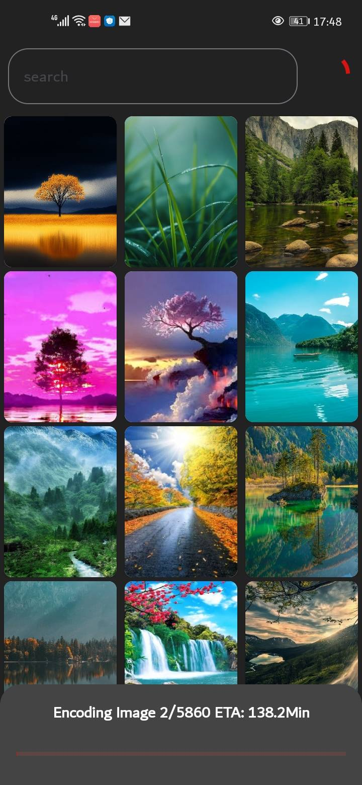

<div align="center">

<div align="center">
  <a href="https://github.com/raslenabb12/Memoria">
    
  </a>
</div>

# Memoria

**Search your photos with words. No cloud. No account. No data leaving your phone.**

[](LICENSE)
[](https://android.com)
[](https://github.com/apple/ml-mobileclip)
[](https://github.com/raslenabb12/Memoria/stargazers)

[Screenshots](#screenshots) · [How it works](#how-it-works) · [Getting started](#getting-started) · [Architecture](#architecture) · [Contributing](#contributing)

</div>

---

## What is Memoria?

Memoria is an open-source Android app that lets you search your photo gallery using natural language — type *"dog at the beach"*, *"birthday cake"*, or *"snowy mountains"* and it finds the right photos instantly.

Everything runs **100% on-device** using Apple's MobileCLIP-S0 model converted to TFLite. No internet connection required after setup. Your photos never leave your phone.

```
You type:  "my dog with a hat"
           ↓
    [MobileCLIP Text Encoder]
           ↓
    512-dimensional vector
           ↓
    cosine similarity search against indexed photo embeddings
           ↓
    ranked results in < 50ms
```

---

## Screenshots
||
|:---:|

---

## Features

- **Semantic photo search** — find photos by meaning, not metadata. "Sunset at sea" finds sunset photos even if they have no tags.
- **Fully offline** — MobileCLIP-S0 runs entirely on-device via TFLite. No API keys, no cloud calls.
- **Privacy first** — photos never leave your device. No account required. No analytics.
- **Open source** — Apache 2.0. Fork it, extend it, learn from it.

---

## How it works

Memoria uses **CLIP** (Contrastive Language–Image Pre-training), a neural network trained on 400 million image-text pairs. It maps both images and text into the same 512-dimensional vector space — meaning semantically similar things have similar vectors, regardless of whether they came from pixels or words.

```
Gallery photo  →  [Image Encoder]  →  512 floats  →  stored in Room DB
Search query   →  [Text Encoder]   →  512 floats  →  cosine similarity search
```

The model used is **MobileCLIP-S0** — Apple's mobile-optimized CLIP variant that achieves the same accuracy as OpenAI's ViT-B/16 while being 4.8× faster and 2.8× smaller.

| Component | Details |
|---|---|
| Image encoder | MobileCLIP-S0 → TFLite float32, 43 MB |
| Text encoder | MobileCLIP-S0 transformer → TFLite float32, 65 MB |
| Vocab | OpenAI CLIP BPE tokenizer, 49,408 tokens |
| Embedding dim | 512 floats per image/query |
| Similarity | Cosine similarity (L2-normalized dot product) |
| DB | Room |

---

## Getting started

### Requirements

- Android 8.0+ (API 26)
- ~200 MB free storage (for models)
- 3 GB+ RAM recommended for GPU acceleration

### Build from source

```bash
git clone https://github.com/raslenabb12/memoria.git
cd memoria
```

model files into `app/src/main/assets/`:

```
mobileclip_s0_image_float32.tflite
mobileclip_s0_text_transformer_float32.tflite
token_embeddings_f16.npy
vocab.json
merges.txt
```

Then open in Android Studio and run.
