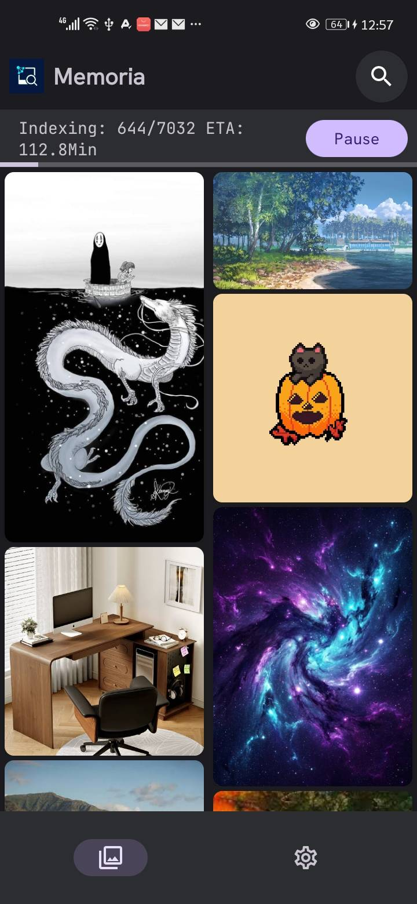
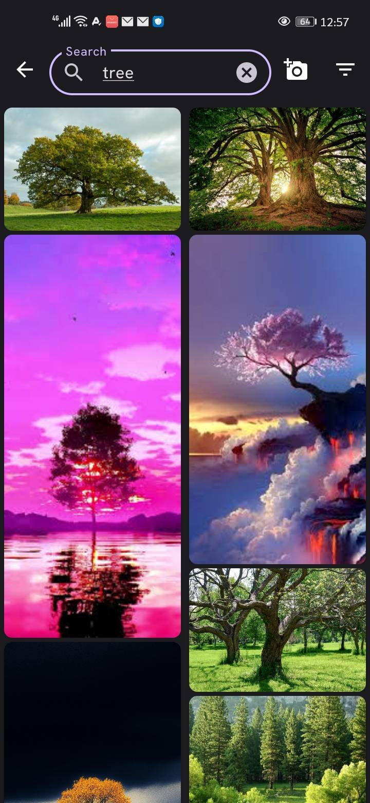
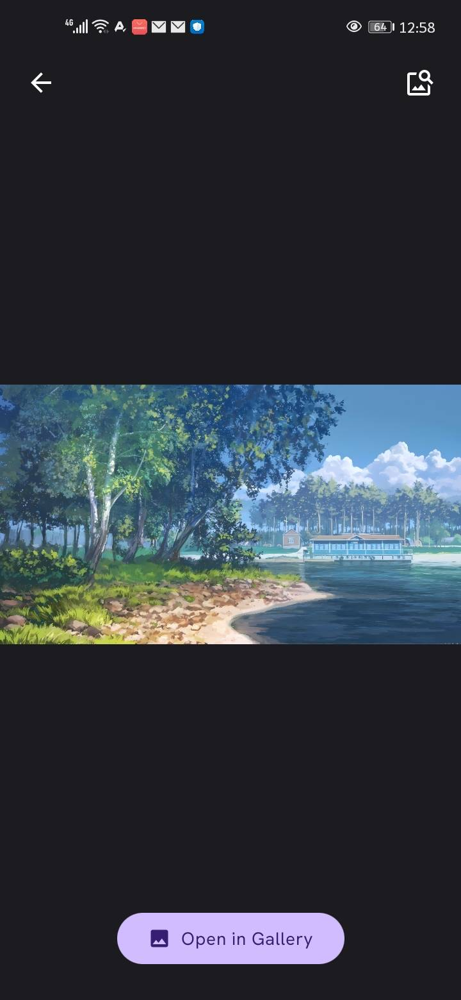
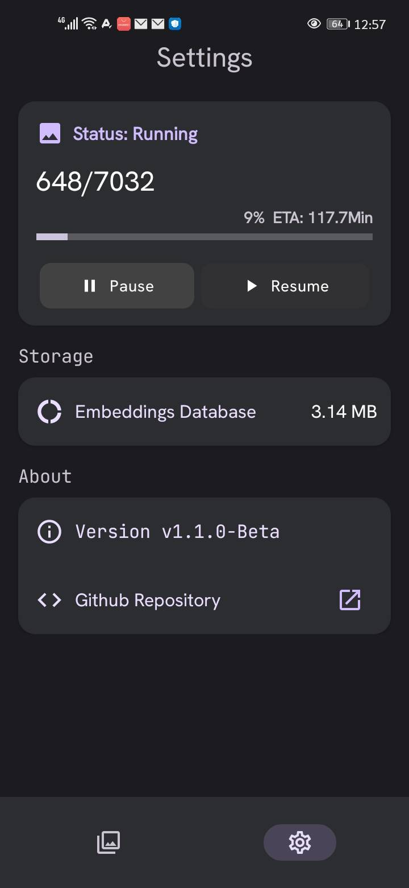
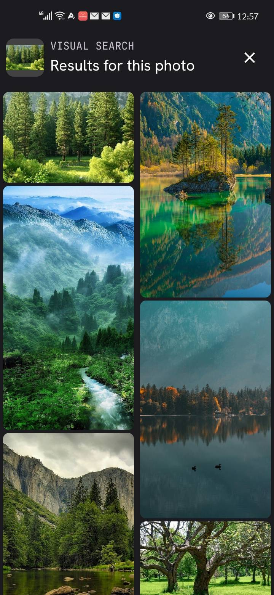
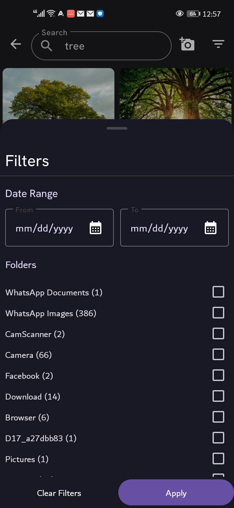

<div align="center">
  <a href="https://github.com/raslenabb12/Memoria">
    
  </a>

# Memoria

**Search your photos with words — or with a photo. No cloud. No account. No data leaving your phone.**

[](LICENSE)
[](https://android.com)
[](https://github.com/apple/ml-mobileclip)
[](https://github.com/raslenabb12/Memoria/releases)
[](https://github.com/raslenabb12/Memoria/stargazers)

[Screenshots](#screenshots) · [How it works](#how-it-works) · [Getting started](#getting-started) · [Architecture](#architecture) · [Roadmap](#roadmap) · [Contributing](#contributing)

</div>

---

## What is Memoria?

Memoria is an open-source Android app that lets you search your photo gallery using natural language — type *"dog at the beach"*, *"birthday cake"*, or *"snowy mountains"* and it finds the right photos instantly.

You can also search **with a photo instead of words** — pick one from anywhere, and Memoria finds visually similar photos already in your gallery. Or open any photo and tap "Find Similar" to see more like it.

Everything runs **100% on-device** using Apple's MobileCLIP-S0 model converted to TFLite. No internet connection required after setup. Your photos never leave your phone.

```
You type:  "my dog with a hat"          You show a photo of a chair
           ↓                                       ↓
    [MobileCLIP Text Encoder]           [MobileCLIP Image Encoder]
           ↓                                       ↓
    512-dimensional vector  ←──── same vector space ────→
           ↓
    cosine similarity search against indexed photo embeddings
           ↓
    ranked results in < 50ms
```

---

## Screenshots

|  |  |  |
|:---:|:---:|:---:|
| Non-blocking indexing progress | Search results | Full-screen photo viewer |

|  |  |  |
|:---:|:---:|:---:|
| Settings | Search by Image | Filters |

---

## Features

- **Semantic photo search** — find photos by meaning, not metadata. "Sunset at sea" finds sunset photos even if they have no tags.
- **Search by photo** — pick one from anywhere and find visually similar photos in your gallery, no text needed.
- **Find Similar** — open any photo and find others like it with one tap, reusing the same embeddings your library is already indexed with.
- **Filters** — narrow search results by date range or folder.
- **Full-screen photo viewer** — tap any result to view it full-screen, swipe between results.
- **Non-blocking indexing** — browse while indexing runs in the background, with a real progress bar and pause/resume support.
- **Settings screen** — live indexing status, storage breakdown, and a link back to this repo.
- **Fully offline** — MobileCLIP-S0 runs entirely on-device via TFLite. No API keys, no cloud calls.
- **Privacy first** — photos never leave your device. No account required. No analytics.
- **Open source** — Apache 2.0. Fork it, extend it, learn from it.

---

## How it works

Memoria uses **CLIP** (Contrastive Language–Image Pre-training), a neural network trained on 400 million image-text pairs. It maps both images and text into the *same* 512-dimensional vector space — meaning semantically similar things have similar vectors, regardless of whether they came from pixels or words. That shared space is what makes text search, search-by-photo, and Find Similar all the same underlying operation:

```
Gallery photo  →  [Image Encoder]  →  512 floats  →  stored in Room DB
Search query   →  [Text  Encoder]  →  512 floats  ─┐
Search photo   →  [Image Encoder]  →  512 floats  ─┼─→  cosine similarity search
Find Similar   →  (reuse stored embedding)         ─┘
```

The model used is **MobileCLIP-S0** — Apple's mobile-optimized CLIP variant that achieves the same accuracy as OpenAI's ViT-B/16 while being 4.8× faster and 2.8× smaller.

| Component | Details |
|---|---|
| Image encoder | MobileCLIP-S0 → TFLite float32, ~44 MB |
| Text encoder | MobileCLIP-S0 transformer → TFLite float32, ~67 MB |
| Token embedding table | float32, ~100 MB |
| Vocab | OpenAI CLIP BPE tokenizer, 49,408 tokens |
| Embedding dim | 512 floats per image/query |
| Similarity | Cosine similarity (L2-normalized dot product) |
| DB | Room |

---

## Getting started

### Requirements

- Android 8.0+ (API 26)
- ~300 MB free storage (for models + local database)
- 3 GB+ RAM recommended for GPU acceleration

### Install

Grab the latest APK from the [Releases page](https://github.com/raslenabb12/Memoria/releases). If you're updating from an older version, **uninstall the previous version first** — the local database format changes between releases while the project is still in alpha/beta.

### Build from source

```bash
git clone https://github.com/raslenabb12/memoria.git
cd memoria
```

Model files go into `app/src/main/assets/`:

```
mobileclip_s0_image_v2.tflite       44 MB
mobileclip_text_reimpl_v2.tflite    67 MB
token_embeddings_f32.bin           100 MB
vocab.json                           1 MB
```

Then open in Android Studio and run.

---

## Roadmap

- [x] Settings screen (indexing status, storage info, theme)
- [x] Search filters — date range, folder
- [x] Search by photo
- [x] Find Similar
- [ ] Camera make/model filter
- [ ] Folder selection (index only chosen folders instead of the full library)
- [ ] Stop control for indexing (pause/resume already shipped)
- [ ] First-run onboarding flow

---

## Contributing

Issues and PRs are welcome. If you're reporting a bug, a screen recording or logcat output goes a long way.

---

## License

Code is licensed under Apache 2.0 — see [LICENSE](LICENSE). The bundled MobileCLIP-S0 model is subject to [Apple's ML Research Model Terms of Use](https://github.com/apple/ml-mobileclip/blob/main/LICENSE_MODELS).
